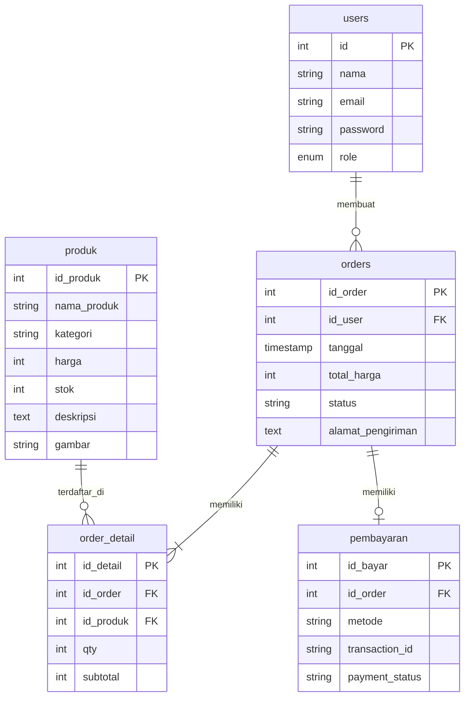
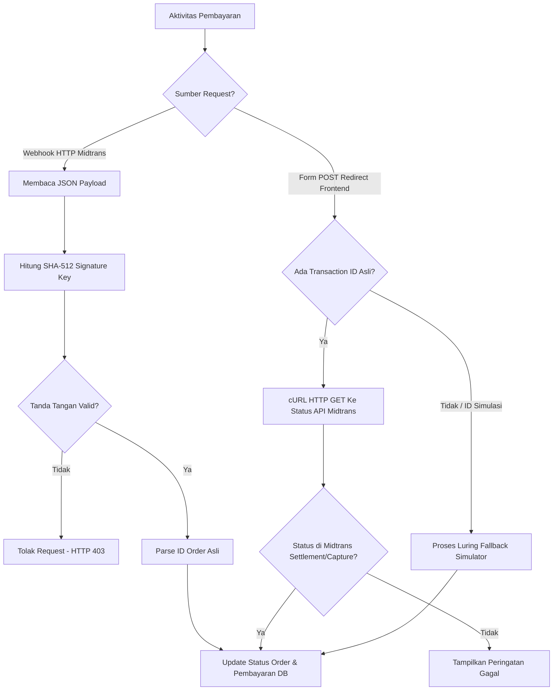

# LAPORAN PEMBUATAN APLIKASI FLEURIST
## Sistem Informasi Penjualan Bunga Segar Premium Berbasis PHP Native & Midtrans Payment Gateway

---

## 1. PENDAHULUAN

### 1.1 Latar Belakang
Dalam industri ritel modern, kecepatan, kenyamanan, dan keamanan transaksi adalah kunci keberhasilan bisnis. **Fleurist** hadir sebagai platform e-commerce penjualan bunga segar premium yang dirancang khusus untuk mempermudah pelanggan memilih bunga segar, menyusun buket custom, serta melakukan pembayaran secara digital dengan cepat dan aman. 

Sistem ini dikembangkan menggunakan **PHP Native** untuk backend dan **MySQL** sebagai sistem basis data. Untuk memfasilitasi transaksi pembayaran digital secara real-time, sistem ini diintegrasikan dengan **Midtrans Payment Gateway** menggunakan metode Snap API.

### 1.2 Tujuan
Tujuan pembangunan aplikasi Fleurist ini adalah:
1. Menyediakan katalog bunga segar premium online yang dapat diakses kapan saja.
2. Memfasilitasi pengguna untuk merangkai buket bunga secara kustom (*custom bouquet*).
3. Menyediakan sistem pembayaran aman yang terintegrasi langsung dengan perbankan dan e-wallet melalui Midtrans.
4. Menyediakan antarmuka panel admin untuk mempermudah manajemen produk, pesanan, dan laporan omset penjualan.

---

## 2. ARSITEKTUR SISTEM & STRUKTUR DIREKTORI

Aplikasi Fleurist memiliki struktur folder yang rapi yang memisahkan bagian antarmuka pelanggan dengan panel administrasi (*admin panel*).

### 2.1 Struktur Folder Utama
```text
toko_bunga/
│
├── admin/                  # Modul Panel Admin
│   ├── dashboard.php       # Ringkasan data & pesanan terbaru
│   ├── laporan.php         # Analisis penjualan (Ekspor Excel/PDF)
│   ├── navbar.php          # Navigasi admin
│   ├── pesanan.php         # Manajemen status order
│   ├── produk.php          # CRUD katalog bunga
│   └── user.php            # Manajemen hak akses pengguna
│
├── uploads/                # Direktori penyimpanan foto bunga
│
├── bayar.php               # Halaman gerbang pembayaran Snap Midtrans
├── callback.php            # Verifikasi transaksi & Webhook Midtrans
├── cart.php                # Keranjang belanja pelanggan
├── checkout.php            # Form alamat & konfirmasi pesanan
├── custom_bouquet.php      # Modul perangkai buket custom
├── database.sql            # Skema basis data MySQL
├── detail.php              # Informasi rinci spesifikasi produk
├── footer.php              # Layout kaki halaman
├── header.php              # Layout navigasi pelanggan (sticky)
├── index.php               # Halaman utama & katalog belanja
├── koneksi.php             # Konfigurasi database & kunci API Midtrans
├── login.php / register.php# Manajemen autentikasi session
├── riwayat.php             # Lacak pesanan & pembayaran pelanggan
└── style.css               # Desain UI Slacc (Aubergine-Cream)
```

---

## 3. ARSITEKTUR BASIS DATA & RELASI TABEL

Database `toko_bunga` dirancang menggunakan mesin penyimpanan InnoDB dengan foreign key untuk menjamin integritas referensial data.

### 3.1 Skema Tabel
Sistem ini menggunakan 5 tabel utama:

1. **`users`**: Menyimpan data akun pelanggan dan administrator.
2. **`produk`**: Menyimpan detail bunga (stok, harga, deskripsi, gambar, kategori).
3. **`orders`**: Menyimpan pesanan yang dilakukan pelanggan (tanggal, total harga, alamat, status).
4. **`order_detail`**: Menyimpan rincian item produk yang dibeli di setiap transaksi.
5. **`pembayaran`**: Menyimpan rekaman transaksi keuangan (metode, UUID transaksi Midtrans, status bayar).

### 3.2 Hubungan Entitas (Entity Relationship)
Berikut visualisasi relasi basis data menggunakan diagram Mermaid:



---

## 4. INTEGRASI MIDTRANS PAYMENT GATEWAY

Salah satu fitur unggulan pada aplikasi ini adalah integrasi pembayaran multi-channel otomatis menggunakan Midtrans API.

### 4.1 Konfigurasi Kredensial ([koneksi.php](file:///c:/xampp/htdocs/toko_bunga/koneksi.php))
Konfigurasi gerbang pembayaran diatur pada file `koneksi.php`:
```php
define('MIDTRANS_SERVER_KEY', 'SB-Mid-server-fJmZ55V9_7P7Y9-L65R7J2nB'); // Server Key Sandbox
define('MIDTRANS_CLIENT_KEY', 'SB-Mid-client-nS9r_NlF22Q2J7vK'); // Client Key Sandbox
define('MIDTRANS_IS_PRODUCTION', false); // Mode pengembangan (Sandbox)
```

### 4.2 Alur Pembuatan Transaksi ([bayar.php](file:///c:/xampp/htdocs/toko_bunga/bayar.php))
1. Pengguna diarahkan ke `bayar.php` dengan parameter ID pesanan.
2. Sistem menyusun JSON payload transaksi yang unik:
   - `order_id`: Diformat sebagai `ORDER-{id_order}-{timestamp}` guna menghindari duplikasi di server Midtrans.
   - `gross_amount`: Total biaya pesanan.
   - `customer_details`: Nama, email, telepon, dan alamat kirim pelanggan.
3. Server melakukan request HTTP POST aman via cURL dengan autentikasi Basic Auth menggunakan Server Key.
4. Midtrans mengembalikan `snap_token` yang digunakan di frontend oleh library `snap.js` untuk memunculkan pop-up pembayaran tanpa meninggalkan website merchant.

### 4.3 Alur Verifikasi & Callback Aman ([callback.php](file:///c:/xampp/htdocs/toko_bunga/callback.php))
Untuk menjamin keamanan dari penipuan dan bypass status bayar, `callback.php` menangani dua jalur input:



#### Validasi Signature Key Webhook:
Sistem menghitung signature tandingan menggunakan rumus:
$$\text{Signature} = \text{SHA512}(\text{order\_id} + \text{status\_code} + \text{gross\_amount} + \text{Server\_Key})$$

Hal ini menjamin database hanya diupdate apabila transaksi dinyatakan sah dan dilunasi langsung melalui server Midtrans.

---

## 5. PANDUAN PENGUJIAN SISTEM (TESTING GUIDE)

### 5.1 Kredensial Bawaan untuk Uji Coba
Untuk menguji fungsionalitas sistem secara langsung:
- **Akun Administrator**:
  - Email: `admin@toko.com`
  - Sandi: `admin`
- **Akun Pelanggan Demo**:
  - Email: `user@toko.com`
  - Sandi: `user`

### 5.2 Skenario 1: Registrasi, Pemesanan & Pembayaran Simulator
1. Masuk ke halaman [login.php](file:///c:/xampp/htdocs/toko_bunga/login.php) menggunakan akun pelanggan `user@toko.com`.
2. Pilih bunga segar premium di halaman [index.php](file:///c:/xampp/htdocs/toko_bunga/index.php) lalu klik **+ Keranjang**.
3. Masuk ke [cart.php](file:///c:/xampp/htdocs/toko_bunga/cart.php), periksa jumlah pesanan, dan klik **Lanjut ke Checkout**.
4. Masukkan alamat pengiriman lengkap dan klik **Buat Pesanan**.
5. Pada halaman gerbang pembayaran [bayar.php](file:///c:/xampp/htdocs/toko_bunga/bayar.php):
   - Jika Server Key valid: Klik **Bayar Sekarang** dan selesaikan pembayaran di pop-up Midtrans.
   - Jika menggunakan localhost secara offline (koneksi ditolak): Gunakan **Simulator Mode Fallback** di bagian kanan halaman, pilih bank simulasi, dan klik **Konfirmasi Bayar**.
6. Anda akan dialihkan secara otomatis ke halaman [riwayat.php](file:///c:/xampp/htdocs/toko_bunga/riwayat.php) dengan status lunas berwarna hijau berkat pemrosesan aman dari `callback.php`.

### 5.3 Skenario 2: Panel Admin & Laporan Penjualan
1. Masuk ke halaman login menggunakan akun administrator `admin@toko.com`.
2. Buka panel admin di direktori `admin/` (misalnya [admin/dashboard.php](file:///c:/xampp/htdocs/toko_bunga/admin/dashboard.php)).
3. Kelola katalog bunga di [admin/produk.php](file:///c:/xampp/htdocs/toko_bunga/admin/produk.php) (tambah produk, edit detail, update stok).
4. Kelola pesanan masuk di [admin/pesanan.php](file:///c:/xampp/htdocs/toko_bunga/admin/pesanan.php). Ubah status pengiriman pesanan (misal: *processed*, *shipped*, *completed*).
5. Masuk ke [admin/laporan.php](file:///c:/xampp/htdocs/toko_bunga/admin/laporan.php) untuk melihat rekapitulasi omset bersih, volume penjualan, dan rata-rata penjualan per transaksi (AOV).
6. Ekspor laporan ke format Microsoft Excel atau cetak PDF langsung melalui tombol cetak yang disediakan.

---

## 6. FITUR & METRIK DESAIN MODERN (AESTHETICS)

Sistem ini didesain dengan mematuhi estetika **Slacc UI**:
* **Tema Warna**: Dominasi warna deep aubergine (`#4a154b`) sebagai warna primer premium, dipadukan dengan latar belakang cream hangat (`#f4ede4`) dan aksen lavender (`#f9f0ff`).
* **Micro-interactions**: Tombol berbentuk pil dengan transisi hover yang halus meningkatkan kepuasan interaksi pengguna.
* **Responsive Layout**: Menggunakan CSS Grid dan CSS Flexbox agar antarmuka tampil sempurna baik di perangkat mobile maupun desktop.

---

## 7. KESIMPULAN & REKOMENDASI PENGEMBANGAN

### 7.1 Kesimpulan
Sistem informasi Fleurist ini berhasil menyelesaikan masalah proses transaksi manual dengan mengadopsi integrasi gerbang pembayaran Midtrans Snap API. Sistem ini juga terbukti aman dari eksploitasi bypass pembayaran berkat adanya validasi signature server-to-server di backend.

### 7.2 Saran Pengembangan
Di masa depan, sistem ini dapat dikembangkan dengan menambahkan:
1. Notifikasi otomatis status pengiriman barang kepada pelanggan menggunakan WhatsApp API / Email SMTP.
2. Integrasi ekspedisi pengiriman (RajaOngkir API) untuk menghitung biaya pengiriman secara real-time berdasarkan berat barang dan lokasi tujuan.
3. Statistik produk paling laris dalam bentuk chart grafis interaktif (misalnya dengan Chart.js) di halaman dashboard admin.
